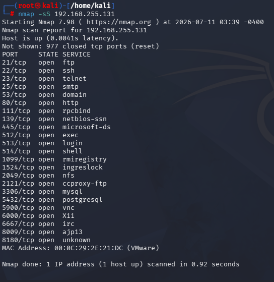
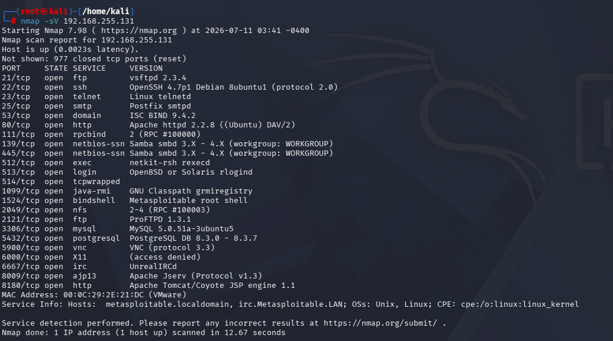

# Nmap Network Reconnaissance Lab

## Overview
This lab involved performing network reconnaissance using Nmap against a target machine in an isolated VMware lab environment. Reconnaissance is typically the first phase of both an attack and a security assessment — identifying what's exposed before deciding what to investigate or defend.

## Objective
To identify open ports, running services, and the operating system of a target machine using five different Nmap scan types, and to understand what each scan type reveals differently.

## Environment
- **Attacker Machine:** Kali Linux (VMware)
- **Target Machine:** Metasploitable 2 (VMware) — intentionally vulnerable Linux VM used for security practice
- **Network Mode:** NAT / Host-only (isolated lab network, no external exposure)

## Tools Used
Nmap, Kali Linux, Metasploitable 2, VMware Workstation

## Steps Performed

**1. SYN Scan**
```
nmap -sS <target-ip>
```
A fast, stealthy scan that checks which ports are open without completing a full TCP handshake.

**2. Service/Version Detection**
```
nmap -sV <target-ip>
```
Identifies the specific service and version running behind each open port.

**3. OS Detection**
```
nmap -O <target-ip>
```
Attempts to fingerprint the target's operating system based on network responses.

**4. Aggressive Scan**
```
nmap -A <target-ip>
```
Combines OS detection, version detection, script scanning, and traceroute into a single comprehensive scan.

**5. All Ports Scan**
```
nmap -p- <target-ip>
```
Scans all 65,535 ports instead of just the most common ones, to catch anything running on non-standard ports.

## Evidence

*SYN scan showing open ports on the target*


*Service and version details identified on open ports*


*OS fingerprinting result for the target machine*


*Combined scan output with additional service banners*


*Full port range scan revealing additional open ports*


## Key Findings
- [Identified 23 open ports including 21 (FTP), 22 (SSH), 23 (Telnet), 80 (HTTP), 445 (SMB)]
- [Service detection revealed vsftpd 2.3.4 running on port 21 and OpenSSH 4.7 on port 22 — both known to have publicly documented vulnerabilities for these versions]
- [OS detection identified the target as running Linux kernel 2.6.x, an outdated and unsupported version]
- [The all-ports scan revealed an additional service on port 8180 running Apache Tomcat, which wasn't visible in the standard port range]

## Insights / Analysis
- Several services identified (FTP, Telnet) transmit data in plaintext, meaning credentials and data could be intercepted if this were a real network — this is a common finding a SOC analyst would flag for remediation.
- In a live SOC environment, seeing this scanning pattern (multiple ports probed sequentially, in a short time window) in firewall or IDS logs would itself be a detectable event — this is exactly the kind of activity a SOC analyst monitors for as a sign of reconnaissance before an attack.
- If this were a real alert, next steps would include checking the source IP's reputation, correlating with any follow-up connection attempts, and confirming whether the scanned services are meant to be internet-facing at all.

## What I Learned
Understanding the difference between scan types matters — a SYN scan is fast and quiet, while an aggressive or all-ports scan is slower but far more thorough. Knowing when to use which is directly relevant to both offensive reconnaissance and defensive detection tuning.
