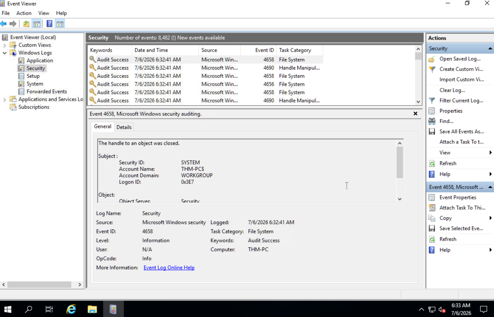

# Windows Logging for SOC

## Overview

Windows event logs are one of the most valuable sources of information for Security Operations Center (SOC) analysts. They provide visibility into authentication events, process execution, user account activity, system changes, and other security-related events that help detect and investigate suspicious behavior.

This project documents my practical learning from the **TryHackMe – Windows Logging for SOC** room. The focus was on understanding Windows logging, investigating security events, analyzing Sysmon telemetry, and learning how different log sources support real-world SOC investigations.

---

# Why Windows Logging Matters

Windows logs help defenders:

- Monitor authentication activity
- Detect brute-force attacks
- Investigate suspicious logins
- Monitor account management
- Detect malware execution
- Identify persistence techniques
- Build investigation timelines
- Support incident response

---

# Windows Event Viewer

Windows Event Viewer is the primary tool used to view and investigate Windows logs.

## Windows Event Viewer

*Figure 1: Explored Windows Event Viewer and navigated through available log categories.*

During this lab I practiced:

- Opening Event Viewer
- Navigating Windows Logs
- Exploring Applications and Services Logs
- Filtering logs by Event ID
- Reviewing event details
- Understanding event properties

---

# Windows Log Categories

| Log | Purpose |
|------|----------|
| Application | Application-generated events |
| Security | Authentication, auditing, and account activity |
| System | Operating system events |
| Setup | Installation-related events |
| Forwarded Events | Logs collected from remote systems |

---

# Windows Security Logs

The Security log is one of the most important log sources for SOC analysts.

Key activities recorded include:

- Successful logons
- Failed logons
- Account creation
- Account deletion
- Password changes
- Privilege assignment
- Group membership changes
- Audit events

---

# Important Windows Event IDs

| Event ID | Description | SOC Use Case |
|-----------|-------------|--------------|
| 4624 | Successful Logon | Track user authentication |
| 4625 | Failed Logon | Detect brute-force or password spraying |
| 4634 | User Logoff | Session tracking |
| 4648 | Logon with Explicit Credentials | Credential misuse investigations |
| 4672 | Special Privileges Assigned | Monitor privileged account activity |
| 4688 | Process Creation | Detect suspicious process execution |
| 4720 | User Account Created | Detect unauthorized account creation |
| 4726 | User Account Deleted | Monitor account lifecycle |
| 4732 | User Added to Security Group | Detect privilege escalation |

---

# Sysmon

Sysmon (System Monitor) extends the default Windows logging capabilities by providing detailed endpoint telemetry. It helps defenders monitor process creation, network connections, registry modifications, DNS queries, and other attacker behaviors that are not fully visible in standard Windows Security logs.

---

# Important Sysmon Event IDs

| Event ID | Description | SOC Use Case |
|-----------|-------------|--------------|
| 1 | Process Creation | Investigate malware execution |
| 3 | Network Connection | Detect outbound command-and-control traffic |
| 11 | File Creation | Monitor dropped or created files |
| 13 | Registry Value Set | Detect persistence techniques |
| 22 | DNS Query | Investigate suspicious domain lookups |

---

# Practical Skills Demonstrated

During this lab I performed the following activities:

- Explored Windows Event Viewer
- Navigated Windows log categories
- Investigated Windows Security Logs
- Filtered logs using Event IDs
- Reviewed authentication events
- Investigated account management events
- Explored Sysmon Operational logs
- Analyzed Sysmon Process Creation events
- Reviewed Sysmon Network Connection events
- Correlated multiple log sources during investigations

---

# Detection Opportunities

| Activity | Primary Log Source |
|----------|--------------------|
| Failed Logons | Security Log (4625) |
| Successful Logons | Security Log (4624) |
| Account Creation | Security Log (4720) |
| Privilege Changes | Security Log (4732) |
| Process Execution | Sysmon Event ID 1 |
| Network Connections | Sysmon Event ID 3 |
| Registry Persistence | Sysmon Event ID 13 |
| DNS Queries | Sysmon Event ID 22 |

---

# SOC Analyst Perspective

A SOC analyst rarely relies on a single log source during an investigation. Authentication events, Sysmon telemetry, and PowerShell logs are correlated to reconstruct attacker activity and identify indicators of compromise.

For example:

- Multiple failed logons (Event ID 4625) followed by a successful logon (Event ID 4624) may indicate a successful brute-force attack.
- Sysmon Process Creation events can identify malicious executables launched after authentication.
- Network Connection events help determine whether a compromised system communicated with external infrastructure.

Correlating these events provides a more complete understanding of attacker behavior.

---

# Evidence

Screenshots of the practical exercises completed during this room are included in the `screenshots/` directory.

Examples include:

- Event Viewer Overview
- Windows Security Log
- Event ID 4625
- Event ID 4624
- Sysmon Operational Log
- Sysmon Event ID 1
- Sysmon Event ID 3

---

# Skills Demonstrated

- Windows Event Viewer
- Windows Event Logging
- Windows Security Logs
- Event ID Analysis
- Authentication Investigation
- Log Filtering
- Sysmon Analysis
- Process Investigation
- Network Connection Analysis
- Security Event Correlation
- Incident Investigation Fundamentals

---

# Key Takeaways

This room strengthened my understanding of how Windows logs support security monitoring and incident investigations. I learned how to navigate Event Viewer, investigate authentication events, analyze Sysmon telemetry, and correlate multiple log sources to better understand attacker behavior from a SOC analyst's perspective.

---

# Learning Source

- TryHackMe – Windows Logging for SOC
