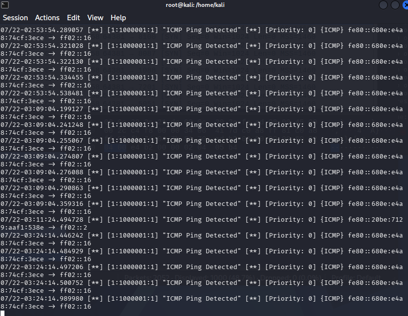
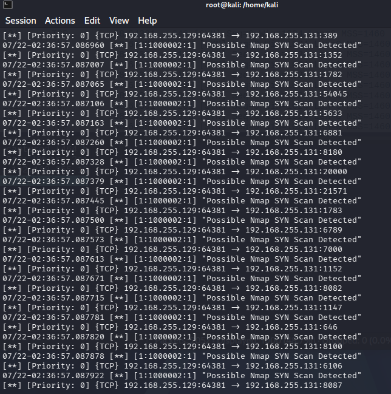
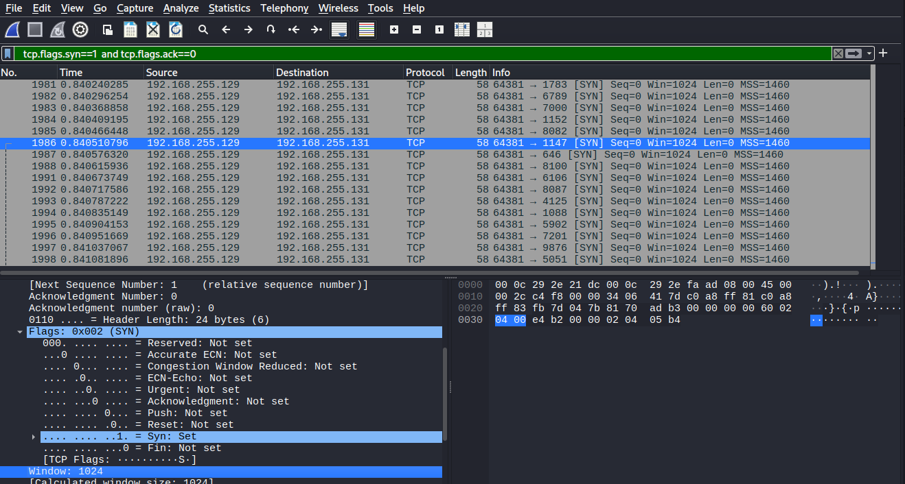
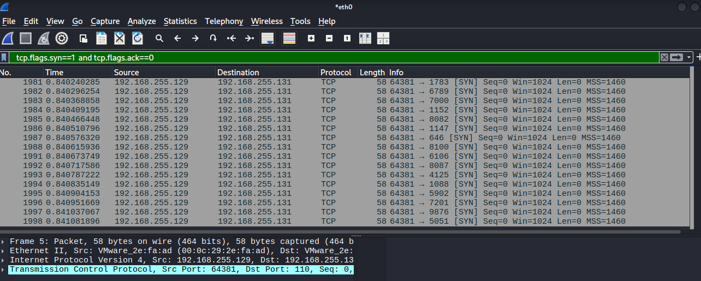

# Network Traffic Analysis with Wireshark + Snort (IDS Detection Lab)

## Overview
This lab was next on my list after the LetsDefend scenario — I wanted hands-on practice with an actual IDS (Snort) and packet-level analysis (Wireshark), instead of just knowing them as theory terms. I set up Snort on my Kali VM to watch traffic, wrote my own detection rules, and used Wireshark to inspect the same traffic at the packet level.

## Objective
Detect suspicious network activity (ICMP pings and an Nmap SYN scan) using Snort as an IDS, and confirm/inspect the same traffic visually using Wireshark — so I could see both the "alert" side and the "raw packet" side of the same event.

## Approach / Environment / Tools Used
- Kali Linux VM (attacker + Snort/Wireshark host) — IP 192.168.255.129
- Metasploitable 2 VM (target) — IP 192.168.255.131
- Snort 3 (installed via apt)
- Wireshark
- Nmap (for generating scan traffic)

## Steps Performed
1. Installed Snort on Kali (`sudo apt install snort`). It installed cleanly but didn't prompt for a HOME_NET setup like I expected.
2. Went looking for the config file — tried the classic `snort.conf` path first, which didn't exist. Found out this install was Snort 3, which uses a different config format (`snort.lua`) instead of the old Snort 2 style. Located it at `/etc/snort/snort.lua`.
3. Set `HOME_NET` to my actual lab subnet (`192.168.255.0/24`) inside `snort.lua`.
4. Ran Snort live on interface `eth0`, then ran an Nmap scan from a second terminal to test it — got zero alerts. Turned out the default config wasn't loading any actual detection rules (only a `file_magic.rules` file for file identification, nothing attack-related), even though a full folder of pre-built rule files (`scan.rules`, `web-attacks.rules`, etc.) already existed on the system.
5. Instead of trying to wire in the pre-built rules (which looked like it needed more config work than I wanted to untangle mid-lab), I wrote my own simple custom rules in `/etc/snort/rules/local.rules`:
   - Rule 1: alert on any ICMP traffic (basic ping detection, as a first test)
   - Rule 2: alert on any TCP packet with only the SYN flag set going to the Metasploitable IP (this is the signature of an Nmap SYN scan)
6. Re-ran Snort, this time explicitly loading `local.rules`. Sent a test ping — got live "ICMP Ping Detected" alerts immediately, confirming Snort was now actually working.
7. Ran `nmap -sS 192.168.255.131` from the second terminal — Snort fired "Possible Nmap SYN Scan Detected" for every single port that got probed.
8. Opened Wireshark on the same interface (`eth0`), started a live capture, and generated traffic again to capture it at the packet level.
9. Applied filters in Wireshark: `icmp` to isolate the ping traffic, then `tcp.flags.syn==1 and tcp.flags.ack==0` to isolate just the scan's SYN-only packets.
10. Clicked into one of the filtered packets and expanded the TCP flags field — confirmed `Flags: 0x002 (SYN)`, with SYN set and ACK not set, matching exactly what the Snort rule was built to catch.

## Evidence

SNORT DETECTION ICMP PING 


SNORT DETECTING NMAP SYN SCAN 


WIRESHARK FILTERED SYN SCAN PACKETS 


WIRESHARK TCP FLAGS DETAIL (SYN SET)

## Key Findings
- Snort 3 uses a completely different config system (Lua-based `snort.lua`) than the older Snort 2 (`snort.conf`) — worth knowing since a lot of tutorials online still reference the old format, which caused some initial confusion.
- Having rule files present on disk doesn't mean they're active — the config has to explicitly load/include them, or nothing gets detected even though Snort is technically "running."
- An Nmap SYN scan has a clear, identifiable signature at the packet level: a burst of TCP packets with only the SYN flag set, no completed handshake (no ACK). This is exactly why writing a rule matching `flags:S` catches it reliably.
- Wireshark showed the scan traffic made up nearly half of the entire capture in just a few seconds — a good visual reminder of how "loud" an unstealthy scan actually is on the wire.

## Insights / Analysis
This lab made the difference between "IDS" as a textbook term and "IDS" as something I've actually configured and watched work in real time. Writing my own rule (instead of just using a pre-built one) also helped me understand what a detection rule is actually doing — matching specific packet characteristics, not some kind of magic pattern-matching. Pairing Snort's alert output with Wireshark's raw packet view was useful too — it's basically the same relationship as an alert in a SIEM vs. the underlying log/packet evidence you'd pull to confirm it.

## What I Learned
- How to write a basic custom Snort rule from scratch, and how to load a custom rule file into a live Snort run.
- How to use BPF-style filters in Wireshark (`icmp`, `tcp.flags.syn==1 and tcp.flags.ack==0`) to cut through a large packet capture and isolate exactly the traffic that matters.
- How to verify a tool's alert manually at the packet level (checking the actual TCP flags) instead of just trusting a summary message.
- When something doesn't work as expected (zero alerts on the first run), the fix is usually to check what's actually configured/loaded rather than assume the tool itself is broken — traced it back myself before asking for help.

## Command Reference
Quick reference of the actual commands used in this lab, in order:

```bash
# Install Snort
sudo apt update && sudo apt install snort -y

# Confirm installation
snort -V

# Locate Snort 3's config file
find / -name "snort.lua" 2>/dev/null

# Edit config to set HOME_NET (inside snort.lua)
sudo nano /etc/snort/snort.lua
# HOME_NET = '192.168.255.0/24'

# Check network interface name
ip a

# Check existing rule files
ls /etc/snort/rules/

# Create custom rules
sudo nano /etc/snort/rules/local.rules
```
```
alert icmp any any -> any any (msg:"ICMP Ping Detected"; sid:1000001; rev:1;)
alert tcp any any -> 192.168.255.131 any (msg:"Possible Nmap SYN Scan Detected"; flags:S; sid:1000002; rev:1;)
```
```bash
# Run Snort with custom rules loaded, live on eth0
sudo snort -i eth0 -c /etc/snort/snort.lua -R /etc/snort/rules/local.rules -A alert_fast

# Generate test traffic (from a second terminal)
ping -c 4 192.168.255.131
nmap -sS 192.168.255.131

# Wireshark filters used
icmp
tcp.flags.syn==1 and tcp.flags.ack==0
```

## Skills Demonstrated
IDS deployment and configuration (Snort 3), custom detection rule writing, packet capture and filtering (Wireshark), TCP flag analysis, troubleshooting a non-firing detection tool, correlating alert-level and packet-level evidence for the same event.
